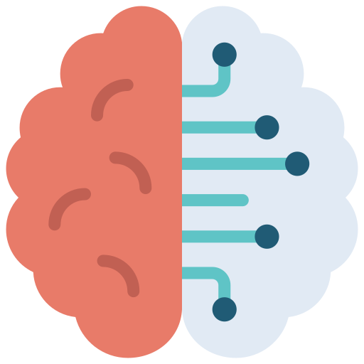
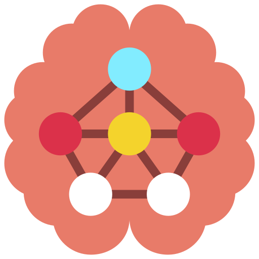
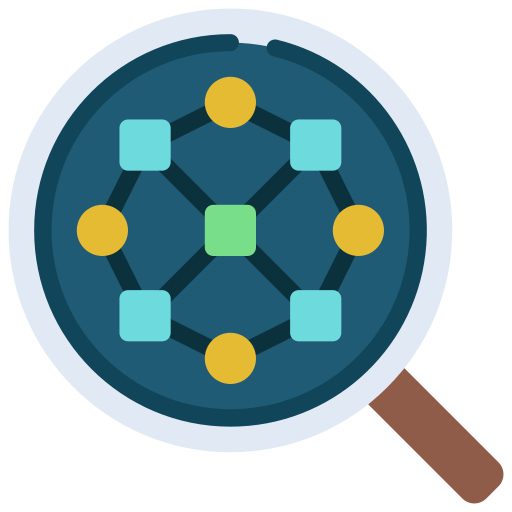
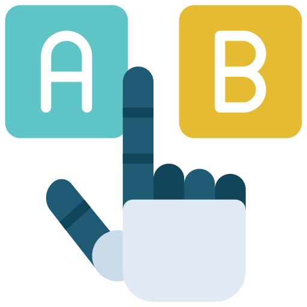

# Hi there, I'm Andrea

I'm a M.Sc. Student of Computer Science and Engineering at Politecnico di Milano.\
I'm actually exploring and studying the following fields:

 Artificial Intelligence

 Machine Learning 

 Reinforcement Learning

 Deep Learning

 Data Mining

 Natural Language Processing

 Recommender Systems

---

### Interesting Projects

- [`Santorini`](https://github.com/Menta99/ing-sw-2020-menta-nisti-manocchio) : Client-Server version of Santorini board game (GUI + CLI)

- [`RecSys2021`](https://github.com/Menta99/RecSys2021_Mainetti_Menta) : TV Series/Movie Recommender System

- [`Gamified-WebApp`](https://github.com/LorenzoMainetti/gamified-webapp-lisi-mainetti-menta) : Gamified version of Consumer Data Collection

---

### About me

 I'm currently working on too many projects

 I'm probably listening to some moody song or watching fancy video  

 I'm surely thinking about new ideas

 I created a podcast called [`La Carota`](https://open.spotify.com/show/3iGKEIh2kDLkyVM4IVWwks?si=039999db099747d5) with a couple of friends 

---

### Get in touch with me

---

### Mindset
*"Luck is the residue of design"*
